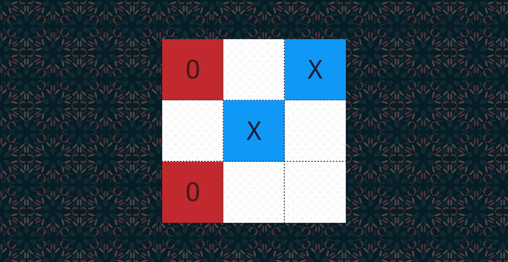

# N ✕ N Tic Tac Toe
An N ✕ N Tic Tac Toe game with an AI opponent build with minimax algorithm, α-β pruning, and a heuristic function. The bot looks four moves ahead to pick the next best move.

## Usage
[https://aravindvasudev.github.io/tic-tac-toe/N](https://aravindvasudev.github.io/tic-tac-toe/N) - change N value to desired board size. (Default: 3)
X & O player are picked randomly.